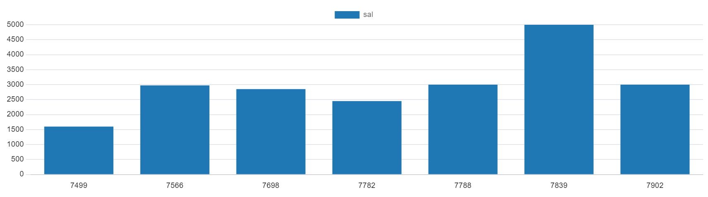

# SQL-Employee-Data-Analysis

---

## Introduction:

The emp database is a sample database for this SQL project. The database contains tables giving information about the employees. The project Is to analyze and derive insights to answer crucial questions, understand what the employee structure of the company comprises of and to help make crucial and data driven decisions as they may arise.
I queried the database to find employees who met certain criteria and wrote queries that picked out some statistics such as the average salary of all employees

**_Disclaimer_**: _All datasets and reports do not represent any company, institution or country, but just a sample dataset to demonstrate capabilities of SQL._

## Problem statement:

1. Which employee joined after the second half of 1981 in order of asc
2. What is the average tenure of employees in the company? 
3. Salary trend for employees identifying as clerk
4. What is the worth in dollars will the company incur if there is 15% sal increase
5. List the emps along with their Exp and Daily Sal is more than Rs.100.

## Skills/ concepts demonstrated:

The following SQL features were incorporated:
- Creating tables
- Exploratory Data Analysis 
- Data Cleaning and Transformation
- Sub querering
- Visualization

## Creating tables:

Code

## Exploratory Data Analysis:

[here](https://github.com/<rubytechme>/<SQL-employee-Data-Analysis>/blob/master/<directory>/<problemstatement.sql>)

## Data Output:

## Visualization:

The report answers 4 questions:
1. Which employee joined after the second half of 1981 in order of asc
2. What is the average tenure of employees in the company? 
3. Salary trend for employees identifying as clerk
4. What is the worth in dollars will the company incur if there is 15% sal increase
5. List the emps along with their Exp and Daily Sal is more than Rs.100.

You can see code [here](https://github.com/rubytechme/SQL-employee-Data-Analysis/blob/main/problemstatement.sql)
	

## Employee join period:

Analysis:
- We had five unique id of emploees that joined second half of 1981 which is about 30% of the total employees.

## Average Tenure:

Analysis:
- After grouping the employees based on the Job type/tittle, it was discovered that employyes who are clerks spends an average of 4 years, presidents 4 years, managers five years, salesman six years, and analyst four years.
- The salesman spent the highest number of years in the business.

## Salary Trend:

Analysis:
- The clerk salary increased by 20% - 25% for 2 years  
- Decreased in the 3rd year

## Extra Cost given a 15% increase:

Analysis:
- This showed the extra cost the business had to incurr with a 15% increase in salary 

## Daily salary more than #50:

Analysis:
- We had about seven employees whose daily salary were more than #50 

## Challenges ecountered:

The problem I encountered was showing the increased values on the y-axis for visualisation. It wasn't showing because it was a string column, so I used the case function to convert the data type to a float column.

The $ sign also gave me a problem and because i didnt want to take it out of my code, i then used the substring so the postgresql does not pick the $ sign 

## Conclusion:
It was really an interesting dataset to workwith and I think they should not reduce the clerk's salary anymore 😄

